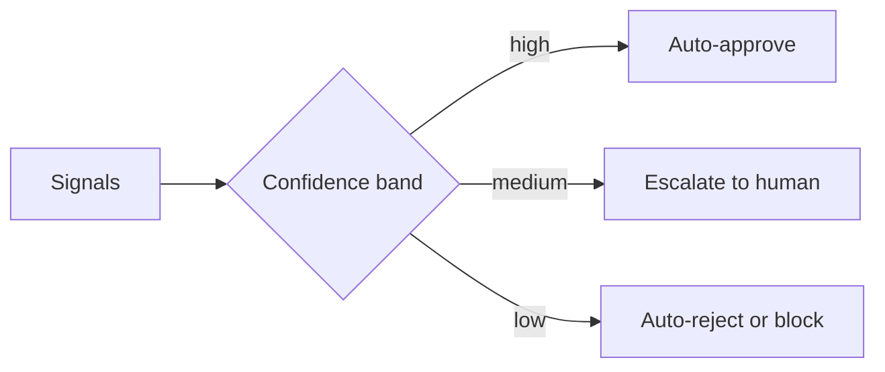
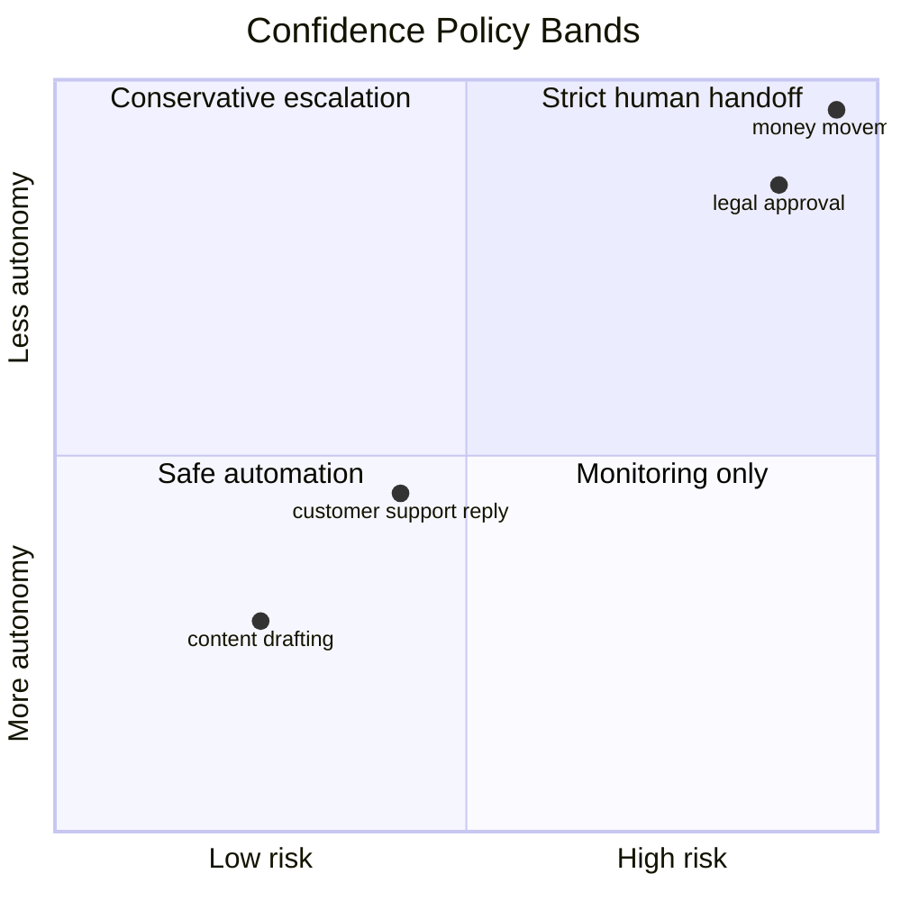

## Autonomy needs limits

An agent that can act is not the same thing as an agent that should act.

The failure mode is familiar: the system sounds confident, takes the action, and discovers too late that the case was novel or adversarial.

The answer is not to remove autonomy. The answer is to define where autonomy ends.



That policy is more useful than a single raw confidence number.

## A threshold is a policy, not a metric

Confidence should combine several signals.

1. Semantic match to known patterns.
2. Novelty of the input.
3. Schema conformance of the output.
4. Agreement across reasoning paths.
5. Model uncertainty or entropy.

Those signals become a decision policy.

```python
from dataclasses import dataclass


@dataclass
class ConfidenceSignals:
    semantic_match: float
    input_novelty: float
    schema_conformance: float
    consistency: float
    uncertainty: float


class ConfidencePolicy:
    def __init__(self):
        self.auto_approve = 0.92
        self.auto_reject = 0.08

    def score(self, signals: ConfidenceSignals) -> float:
        return (
            signals.semantic_match * 0.3
            + (1 - signals.input_novelty) * 0.2
            + signals.schema_conformance * 0.25
            + signals.consistency * 0.25
            - signals.uncertainty * 0.1
        )

    def decide(self, signals: ConfidenceSignals) -> str:
        confidence = self.score(signals)
        if confidence >= self.auto_approve:
            return "APPROVE"
        if confidence <= self.auto_reject:
            return "REJECT"
        return "ESCALATE"
```

## Set thresholds by risk, not by convenience

A low-risk draft can tolerate a wider autonomous range than a wire transfer or infrastructure change.



The policy should shift with the consequences, not with the model's mood.

## The human handoff has to be cheap

Escalation only works if it is easy for the human to pick up the case.

- Show the evidence the agent used.
- Show the confidence score and why it was low.
- Provide one-click accept, edit, reject, or send back.
- Preserve the full trace for later review.

If escalation is painful, teams will start ignoring the policy.

## Monitor calibration over time

Thresholds drift.

You should watch for:

- Escalation rate rising unexpectedly.
- Auto-approve decisions that humans often override.
- False rejections on easy cases.
- High-confidence decisions that turn out wrong.

Those signals tell you whether the policy is calibrated or just optimistic.

## Practical rule

Agents should only decide alone inside the range where you have evidence that they are usually right.

Outside that range, the best behavior is to stop and hand the decision to a human.

## Related Posts

- [Agents in the Loop: Designing for Human-AI Collaboration Instead of Replacement](/blog/human-ai-collaboration)
- [The Hallucination Budget: Quantifying Risk for Mission-Critical Agents](/blog/hallucination-budget)
- [Observability for Black-Box Agents: Tracing Decisions in Production](/blog/agent-observability)