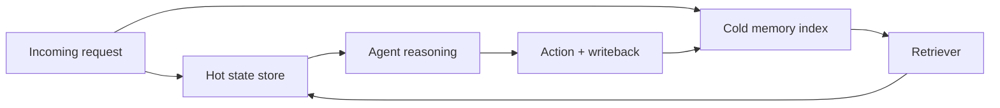
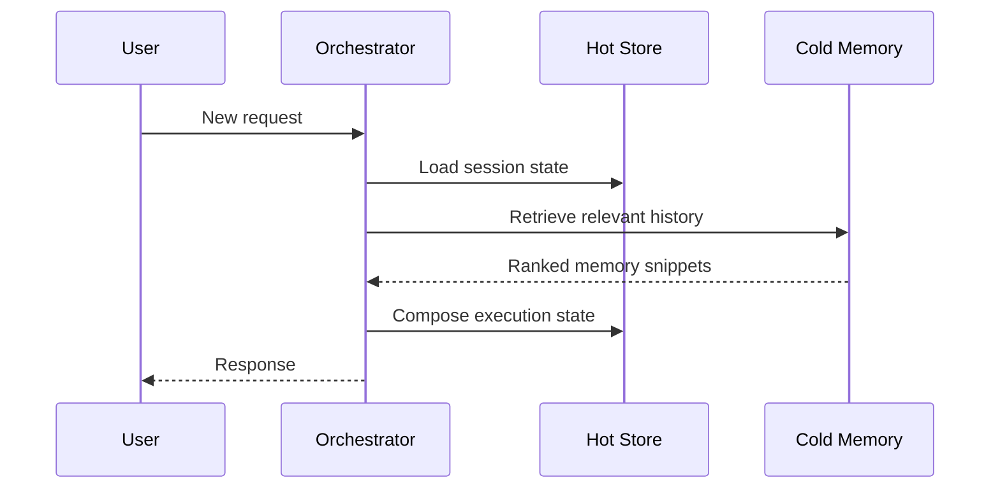

## Context windows are not a memory architecture

A larger context window can delay memory design decisions, but it cannot replace them.

Production agents fail when they treat all past information as equally important. The result is bloated prompts, slow responses, and contradictory behavior.

The fix is architectural: separate memory by purpose and time horizon.

## Use hot memory for active execution

Hot memory contains only what is needed for the current decision loop.

Examples:

- Current task goal
- Latest tool outputs
- Active constraints and policy flags
- Session-level user intent

Hot memory should be compact, structured, and aggressively pruned.

## Use cold memory for historical context

Cold memory is durable history you retrieve when relevant.

Examples:

- Past decisions and outcomes
- User preferences over time
- Incident and escalation history
- Domain-specific reference facts



This keeps active reasoning focused while preserving long-term context.

## Introduce memory write policies

Not every event should become memory.

Useful write rules:

1. Only persist high-signal events (confirmed preferences, outcomes, corrections).
2. Tag memory entries with confidence and source.
3. Expire low-value ephemeral traces.
4. Require schema validation before writes.

```python
from dataclasses import dataclass
from datetime import datetime


@dataclass
class MemoryEvent:
    event_type: str
    payload: dict
    confidence: float
    source: str
    created_at: datetime


def should_persist(event: MemoryEvent) -> bool:
    high_value_types = {"preference_confirmed", "decision_outcome", "policy_override"}
    return event.event_type in high_value_types and event.confidence >= 0.8
```

Without this filter, memory becomes noise that degrades future decisions.

## Retrieval should be policy-aware

When assembling context from cold memory, apply filters:

- Relevance to current task
- Recency and validity window
- Trust level by source
- Conflict resolution between entries

Returning every similar memory chunk is not intelligence. It is context pollution.

## Design for contradiction handling

User preferences and policies change. Memory systems must support conflict management.

Patterns that help:

- Keep immutable event logs for auditability.
- Build derived "current state" views from events.
- Record superseded entries instead of deleting history.

This makes explanations and rollback far easier.

## Performance and cost benefits

A hot/cold design improves:

- Latency: smaller active context.
- Cost: fewer unnecessary tokens.
- Stability: less contradiction in prompts.
- Debuggability: clearer state boundaries.



## Operational checklist

Before shipping long-running memory:

- Define persistence policy and schema.
- Add memory quality metrics (hit quality, contradiction rate, stale recall).
- Add retention and deletion controls.
- Add explainability hooks for what memory influenced decisions.

Memory architecture is product behavior architecture.

## Practical takeaway

Reliable long-running agents need explicit memory tiers.

Keep hot state minimal, keep cold memory durable and searchable, and enforce strict write/retrieval policies to avoid context drift.

## Related Posts

- [State Management Without the Mess: Deterministic Agent Memory for Long-Running Systems](/blog/state-management-agent-memory)
- [Token Economics: Why Your Agent Architecture Is Costing 10x More Than It Should](/blog/token-economics-agent-architecture)
- [Orchestrating Agents at Scale: When You Need a Supervisor, Not a Bigger Model](/blog/orchestrating-agents-scale)
