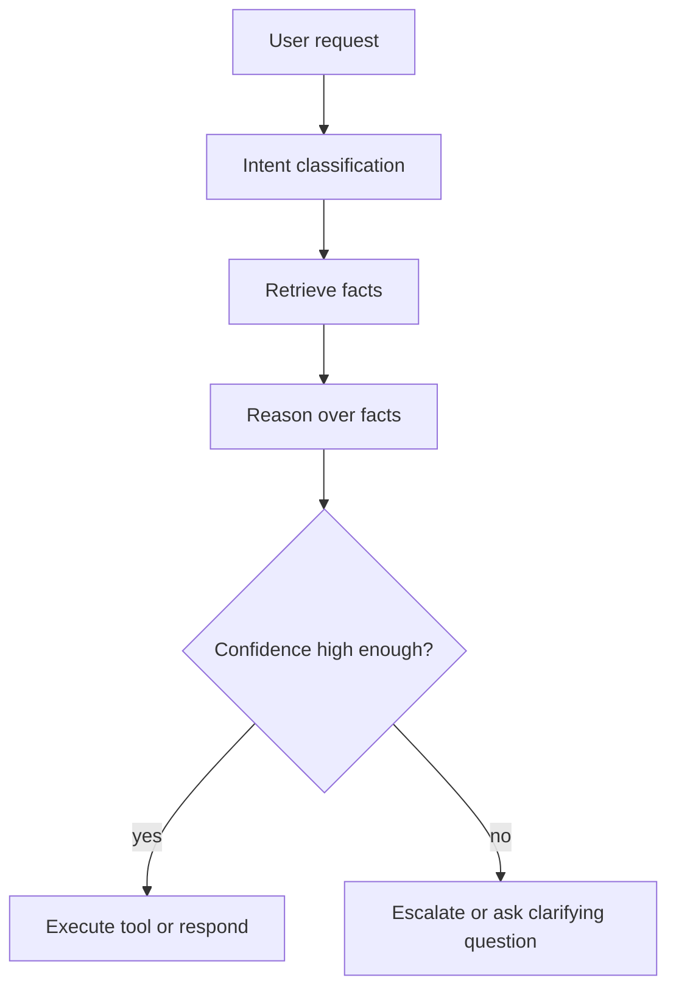
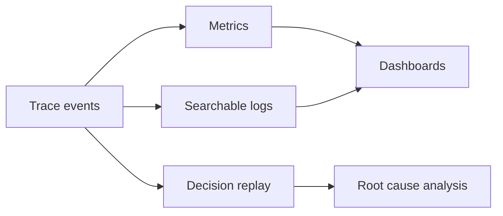

## Why normal logs are not enough

Traditional logging tells you that a request failed.

Agent observability has to answer a harder question: why did the system choose that action in the first place?

For agents, the useful unit of inspection is not a service call. It is a decision path.



If you cannot replay this path, you cannot really debug the agent.

## What to record at each step

Good traces are structured, not just verbose.

1. The input the step received.
2. The output the step produced.
3. The confidence or score attached to the step.
4. The sources that influenced the decision.
5. The tool call or side effect that followed.

That is enough to reconstruct most failures without dumping the full prompt into every log line.

## A trace schema that stays useful

```python
from dataclasses import dataclass, asdict
from typing import Any
import time


@dataclass
class ReasoningEvent:
    decision_id: str
    step: str
    input_snapshot: dict[str, Any]
    output_snapshot: dict[str, Any]
    confidence: float
    sources: list[str]
    reasoning: str
    created_at: float


class ReasoningTracer:
    def __init__(self):
        self.events: list[ReasoningEvent] = []

    def record(self, event: ReasoningEvent) -> None:
        self.events.append(event)

    def replay(self, decision_id: str) -> list[ReasoningEvent]:
        return [event for event in self.events if event.decision_id == decision_id]
```

This gives you a few important properties.

- You can query one decision end to end.
- You can compare decisions across releases.
- You can build dashboards around confidence drift, not just error counts.

## How a failure gets debugged

When an agent makes a bad call, walk the trace in order.

```python
def inspect_decision(tracer: ReasoningTracer, decision_id: str) -> None:
    for event in tracer.replay(decision_id):
        print(f"[{event.step}] confidence={event.confidence:.2f}")
        print(f"sources={', '.join(event.sources)}")
        print(f"reasoning={event.reasoning}")
        print(f"output={event.output_snapshot}\n")

    weakest = min(tracer.replay(decision_id), key=lambda event: event.confidence)
    print(f"weakest step: {weakest.step}")
```

That pattern makes the failure obvious. Most bugs are not random. They are one of these:

- Bad retrieval.
- Weak confidence calibration.
- Over-trusting a tool result.
- A prompt or policy change that altered the decision boundary.

## Dashboards that matter

The right dashboard shows decision quality over time.

- Step-level latency.
- Step-level confidence distributions.
- Override rate for human-in-the-loop decisions.
- Retry counts per tool.
- Outcomes grouped by request type.



That combination is what turns observability into a debugging tool instead of a compliance checkbox.

## What not to do

- Do not log only final answers.
- Do not store raw reasoning text without redaction rules.
- Do not merge every step into one giant blob.
- Do not treat confidence as a decorative field.

## The practical rule

If you cannot answer “what did the agent know when it acted?”, your observability layer is incomplete.

The goal is not perfect introspection. The goal is a replayable decision history that makes production failures boring to debug.

## Related Posts

- [The Latency Trap: Why 99th-Percentile Response Time Matters More Than Average](/blog/latency-percentiles)
- [State Management Without the Mess: Deterministic Agent Memory for Long-Running Systems](/blog/state-management-agent-memory)
- [The Hallucination Budget: Quantifying Risk for Mission-Critical Agents](/blog/hallucination-budget)