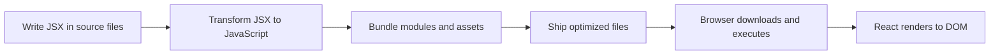
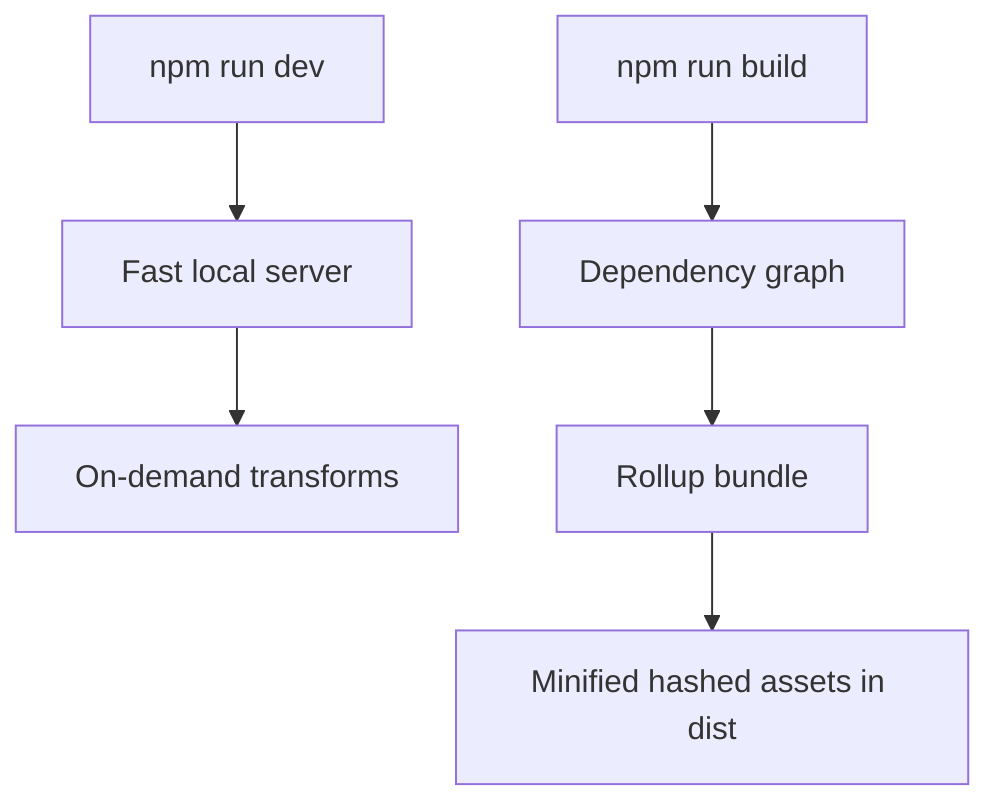
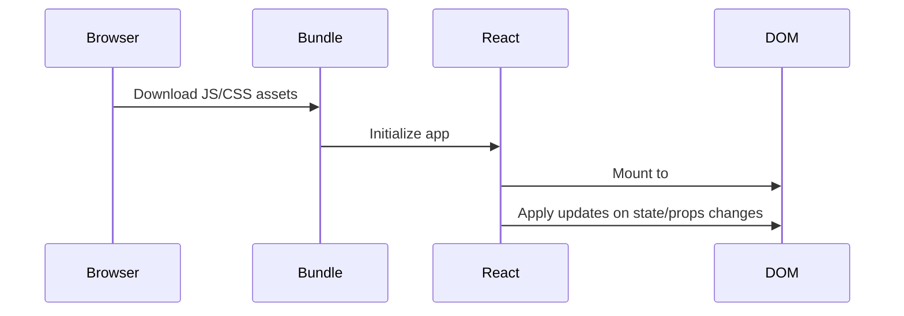

React feels magical when you are new to it. You write a component, run the app, and pixels appear. But in reality, there is a very concrete pipeline from source code to browser rendering.

This article breaks that pipeline into practical steps so you can reason about performance, debugging, and build output with confidence.

## The high-level pipeline



If you understand each stage, React becomes much less mysterious.

## Stage 1: What the browser understands

A browser can parse HTML, CSS, and JavaScript. It cannot parse JSX syntax like this directly:

```jsx
const node = <h1>Hello, React!</h1>;
```

When JSX reaches the browser untransformed, you get errors like unexpected token `<`.

That is why JSX needs a transformation step before execution.


## Stage 2: What JSX really becomes

JSX is syntax sugar. It is translated into JavaScript function calls.

```jsx
const node = <h1 className="title">Hello</h1>;
```

becomes roughly:

```js
const node = React.createElement("h1", { className: "title" }, "Hello");
```

This translation is why JSX feels declarative while still being plain JavaScript at runtime.


## Stage 3: Babel and syntax transforms

Babel is one of the tools that can transform modern syntax (including JSX) into JavaScript your environment can execute.

Typical flow:

1. Parse source into an AST.
2. Apply transformation plugins.
3. Emit transformed JavaScript.

In modern Vite projects, you normally do not wire Babel manually for basic React JSX support, but the conceptual transform step still exists.

## Stage 4: Vite in development vs production

Vite has two personalities:

1. Development mode: fast server and on-demand module transforms.
2. Production build: optimized bundling, minification, and hashed assets.



That split is one reason Vite feels fast while still producing production-grade output.

## Stage 5: What npm run build actually does

When you run a production build, Vite typically does the following:

1. Reads your config and entry points.
2. Resolves imports and builds the module graph.
3. Bundles JavaScript and CSS.
4. Applies optimizations (tree-shaking, minification, hashing).
5. Writes final assets to dist.


Those hashed filenames are intentional. They help long-term browser caching and safe cache-busting on deploy.

## Stage 6: From bundle to pixels

At runtime, the browser loads index.html and the referenced bundle(s). React then mounts into a root element and updates the DOM as state changes.



The browser never executes JSX directly in production. It executes the transformed and bundled JavaScript.

## Practical debugging tips from this model

- If JSX syntax errors appear in browser, transformation likely did not run.
- If app works in dev but not in build, inspect bundling assumptions and dynamic imports.
- If styles or scripts look stale, verify hashed asset references and cache behavior.
- If initial load is slow, inspect bundle composition and split points.

## Why this matters

Knowing the JSX-to-pixels path helps you:

- Debug faster.
- Build better mental models of React.
- Make smarter performance decisions.
- Understand what your deployment pipeline is actually shipping.

React becomes easier once you stop treating it as magic and start treating it as a predictable toolchain.
