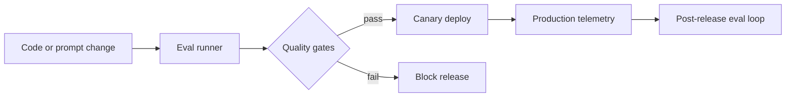
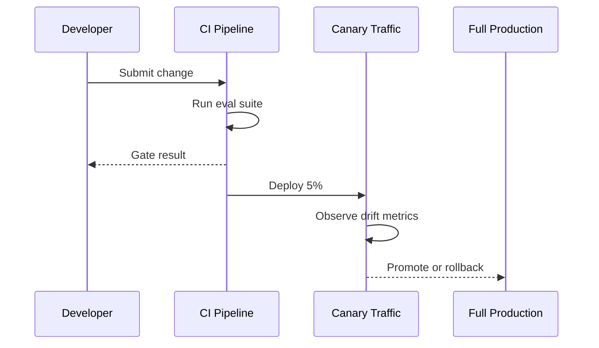

## Most agent regressions are release-process regressions

Teams often blame the model when behavior degrades in production. In reality, many incidents start in delivery pipelines that do not measure what changed.

For classic software, CI catches broken tests. For agents, the equivalent is an eval harness that catches behavioral drift before rollout.

If your release process is only "manual spot checks + vibes," you are not shipping an AI system. You are gambling.

## Define what "good" means before changing anything

A useful eval suite is not a random benchmark set. It should reflect your own product risk.

At minimum, define three categories:

1. Accuracy tasks: Did the system produce the right answer or action?
2. Safety tasks: Did it avoid policy violations or disallowed behavior?
3. Reliability tasks: Did it remain stable under noisy and ambiguous inputs?



The winning pattern is simple: every release candidate goes through the same gates.

## Keep evals versioned like code

Prompts, schemas, and tool policies evolve. Your eval set should evolve too.

Treat evals as first-class artifacts:

- Keep them in-repo.
- Version scenarios by risk domain.
- Tag each case with expected behavior and failure severity.
- Review eval changes in pull requests.

```python
from dataclasses import dataclass


@dataclass
class EvalCase:
    case_id: str
    input_payload: dict
    expected_outcome: dict
    risk_tier: str  # low, medium, high
    block_on_fail: bool


def should_block_release(results: list[dict]) -> bool:
    critical_failures = [r for r in results if r["block_on_fail"] and not r["passed"]]
    return len(critical_failures) > 0
```

The point is deterministic release behavior. Same inputs, same expected standard.

## Build quality gates that reflect business risk

Not every failure should block a release, but some should block immediately.

A practical gate structure:

- Hard block: policy violations, unsafe tool calls, broken schema outputs.
- Conditional block: high-risk task accuracy below threshold.
- Warning only: low-risk copy quality drops.

This avoids both extremes: over-blocking and reckless shipping.

## Use canary deploys for behavioral drift

Passing offline evals is necessary, not sufficient. Online behavior can still drift because user distributions differ from test data.

Deploy a small canary slice first.

Monitor:

- Escalation rate changes.
- Retry inflation.
- Tool failure spikes.
- Human override rate.



If canary metrics degrade, roll back even if offline evals passed.

## Close the loop with incident-driven eval additions

Every real incident should produce at least one new eval case.

This is how systems mature:

1. Incident happens.
2. Root cause is identified.
3. Reproducible eval case is added.
4. Future releases are protected.

Without this loop, teams repeat the same failures with better dashboards.

## Common anti-patterns to avoid

- One giant "overall score" with no risk segmentation.
- Mixing prompt experiments into production without gate updates.
- No frozen baseline for A/B comparisons.
- Measuring only latency and cost, ignoring correctness and safety.

## Release checklist for agent teams

Before promoting to full traffic, require:

- Eval suite pass for hard-block cases.
- No policy regressions.
- Canary metrics within control limits.
- Rollback path tested and documented.

The implementation details can vary. The discipline should not.

## Practical takeaway

High-quality agent behavior in production is a release engineering outcome.

If your team wants reliability, build eval gates into CI and treat behavioral quality as a deploy criterion, not a postmortem topic.

## Related Posts

- [Observability for Black-Box Agents: Tracing Decisions in Production](/blog/agent-observability)
- [When Agents Should Not Decide: Building Confidence Thresholds for Human Handoff](/blog/agent-confidence-thresholds)
- [The Hallucination Budget: Quantifying Risk for Mission-Critical Agents](/blog/hallucination-budget)
