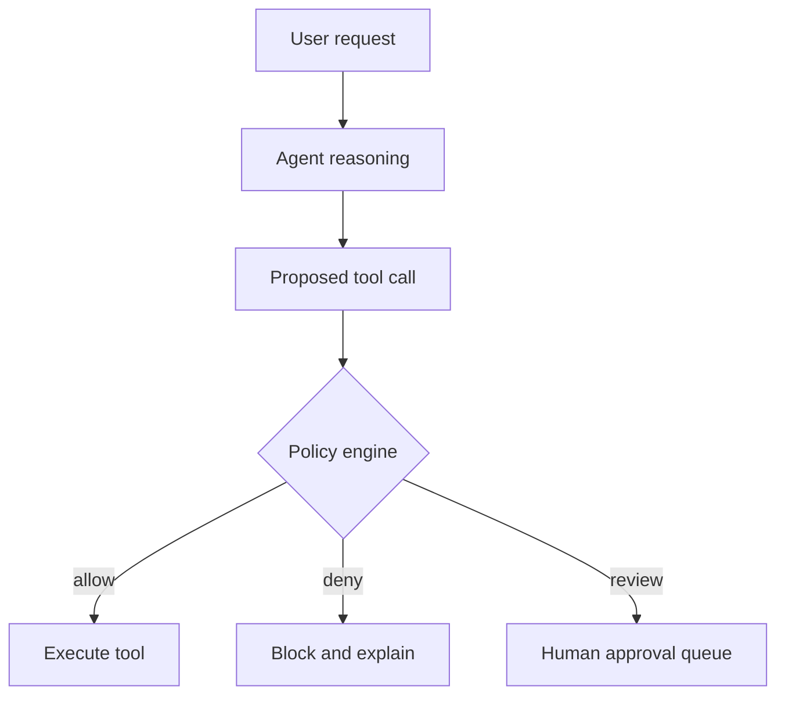
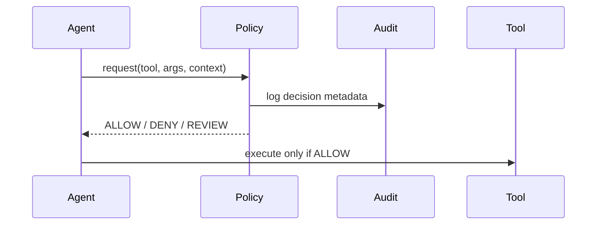

## Prompt rules are guidance, not enforcement

Most teams start with system prompt constraints. That is useful, but not sufficient for tool-using agents.

When a model output can trigger external actions, safety must be enforced outside generation.

A policy engine creates this enforcement layer.

## What a policy engine should decide

Before any tool call executes, evaluate:

1. Is the intent in an allowed category?
2. Is the user authorized for this action?
3. Is the tool call argument schema valid?
4. Does this action require human approval?
5. Is rate and scope within limits?



This pattern removes policy power from free-form text and puts it into explicit logic.

## Use risk tiers for action categories

Not all actions need identical controls.

A practical tiering model:

- Tier 1 (low risk): read-only lookup
- Tier 2 (medium risk): user-visible updates with rollback
- Tier 3 (high risk): financial, legal, or irreversible actions

Policy behavior should vary by tier.

```python
RISK_TIERS = {
    "search_docs": "tier1",
    "update_ticket": "tier2",
    "refund_payment": "tier3",
}


def policy_decision(tool_name: str, user_role: str) -> str:
    tier = RISK_TIERS.get(tool_name, "tier3")
    if tier == "tier1":
        return "ALLOW"
    if tier == "tier2" and user_role in {"support", "admin"}:
        return "ALLOW"
    if tier == "tier3":
        return "REVIEW"
    return "DENY"
```

Simple rules outperform vague prompt instructions in high-stakes paths.

## Validate arguments before policy checks

Policy decisions are only meaningful if arguments are typed and sanitized.

Do not evaluate raw model text. Parse into a strict schema first, then run policy.

This prevents prompt injection or malformed outputs from bypassing rule intent.

## Add explainable denials and audit logs

Blocked actions should produce clear machine-readable reasons.

Audit logs should capture:

- Request context
- Proposed tool and arguments
- Policy decision
- Human override (if any)



Without auditability, safety decisions are hard to improve and impossible to defend.

## Build for graceful failure

Policy denials should not crash the user experience.

Preferred behavior:

- Explain what was blocked and why.
- Offer safe alternatives.
- Route high-risk requests to human workflows.

This preserves trust while keeping controls strict.

## Common mistakes

- Encoding policy only in prompts.
- Running policy checks after tool execution.
- Giving one global policy to all tools.
- Ignoring decision logs and overrides.

The result is usually inconsistent safety and hard-to-debug incidents.

## Practical takeaway

Guardrails that survive real traffic are executable policy, not prose.

Use typed tool calls, risk-tiered decisions, and pre-execution enforcement to keep autonomous systems both useful and safe.

## Related Posts

- [Prompt Injection in Agents: Defense Patterns That Actually Work](/blog/prompt-injection-defense)
- [When Agents Should Not Decide: Building Confidence Thresholds for Human Handoff](/blog/agent-confidence-thresholds)
- [Orchestrating Agents at Scale: When You Need a Supervisor, Not a Bigger Model](/blog/orchestrating-agents-scale)
