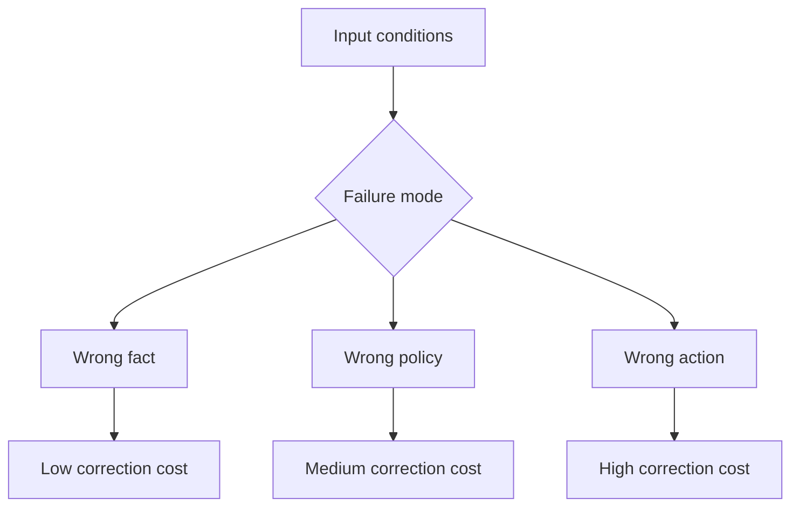
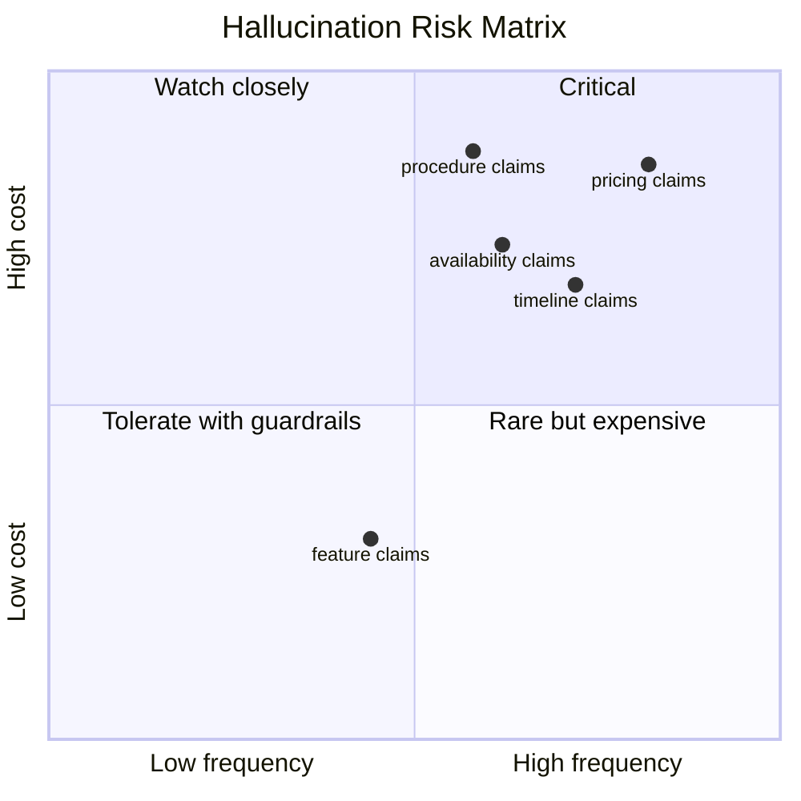

## Hallucinations are a risk profile, not a mystery

The useful question is not whether a model can hallucinate.

The useful question is: what kind of hallucination, how often, and what does it cost when it slips through?

In production, hallucinations cluster around a small set of situations: conflicting sources, novel inputs, overconfident synthesis, and domains where the model can sound plausible while being wrong.



That structure is what makes a hallucination budget possible.

## Classify the failure modes first

Not all hallucinations carry the same risk.

1. Feature claims: the agent invents product capabilities.
2. Pricing claims: the agent states the wrong plan or discount.
3. Availability claims: the agent says a service exists when it does not.
4. Timeline claims: the agent invents a delivery date or roadmap.
5. Procedural claims: the agent tells a user to do the wrong next step.

These categories matter because each one has a different correction cost.

## Turn hallucination rate into business risk

A flat accuracy metric hides the actual damage.

What matters is the expected cost of a mistake.

```python
from dataclasses import dataclass
from enum import Enum


class HallucinationType(Enum):
    FEATURE = "feature"
    PRICING = "pricing"
    AVAILABILITY = "availability"
    TIMELINE = "timeline"
    PROCEDURE = "procedure"


@dataclass
class HallucinationEvent:
    kind: HallucinationType
    confidence: float
    caught: bool
    correction_cost: float


def budget(events: list[HallucinationEvent]) -> dict[str, float]:
    total_cost = sum(event.correction_cost for event in events)
    caught_rate = sum(1 for event in events if event.caught) / max(1, len(events))
    return {"total_cost": total_cost, "caught_rate": caught_rate}
```

This is the metric that matters in production: how much damage the model causes before the correction loop catches it.

## Build a risk matrix



The top-right quadrant is where engineering time should go first.

## Defenses should match the cost

Cheap mistakes can be handled with lightweight validation.

Expensive mistakes need stricter controls.

- Low-cost claims: post-generation checks and user-visible disclaimers.
- Medium-cost claims: retrieval validation and source citations.
- High-cost claims: schema-checked answers, policy gates, or human review.
- Critical claims: do not let the model commit the action alone.

The point is not to eliminate all hallucinations. The point is to spend defense effort where the expected loss is highest.

## What to measure every day

- Hallucination type frequency.
- Correction cost by type.
- Time to detection.
- Time to correction.
- Confidence versus actual correctness.

If confidence is high and correctness is low, calibration is broken.

## Practical rule

Treat hallucination risk like any other production risk budget.

If the agent can be wrong, classify the wrongness, estimate the cost, and put the expensive cases behind stronger controls.

## Related Posts

- [Observability for Black-Box Agents: Tracing Decisions in Production](/blog/agent-observability)
- [When Agents Should Not Decide: Building Confidence Thresholds for Human Handoff](/blog/agent-confidence-thresholds)
- [State Management Without the Mess: Deterministic Agent Memory for Long-Running Systems](/blog/state-management-agent-memory)