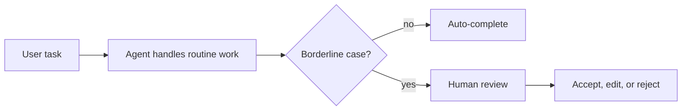
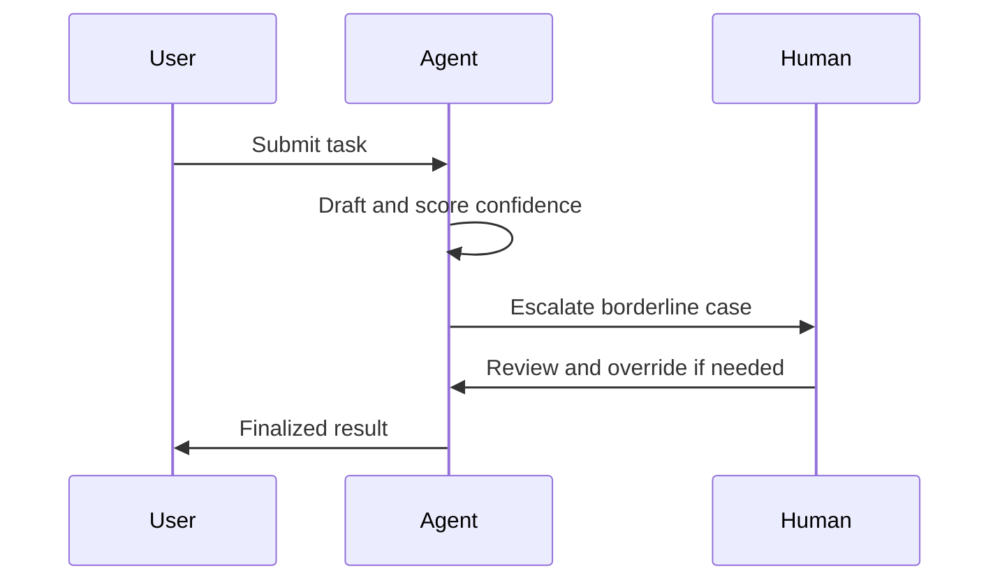

## The collaboration problem

Most production systems fail because they ask the wrong question.

The question is not whether an agent can do the work alone.

The question is whether the agent makes the human faster, more accurate, and less overloaded.



That is the design target: a workflow where the human still matters, but does not have to start from zero.

## Where augmentation wins

A good collaboration system splits the task by confidence and responsibility.

- The agent extracts, clusters, drafts, and flags.
- The human judges nuance, policy, and the final consequence.

This is especially strong in legal review, customer support, compliance, and operations work.

In those domains, the agent saves time on the boring part and the human protects the edge cases.

## Make confidence visible in the UI

If the user cannot see uncertainty, they will overtrust the result.

Confidence should be part of the interface, not buried in logs.

```python
class AugmentedAgentUI:
    def render(self, suggestion: str, confidence: float) -> str:
        return f"""
        <section class='suggestion-card'>
          <p>{suggestion}</p>
          <meter value='{confidence}' min='0' max='1'></meter>
          <div class='actions'>
            <button>Accept</button>
            <button>Edit</button>
            <button>Reject</button>
          </div>
        </section>
        """
```

That small design choice changes behavior. People treat machine output differently when they can see that the system is unsure.

## Design the interruption point

Do not wait until the end of the workflow to involve the human.

The best systems interrupt early when the case becomes ambiguous.



The point is to keep the human in the loop without making them a bottleneck.

## Measure the collaboration, not just the model

If the agent helps, you should be able to prove it.

Track metrics like these:

- Time saved per task.
- Human correction rate.
- Acceptance rate of the agent's suggestion.
- Quality of overruled cases.
- Rework saved after the agent’s first pass.

```python
def collaboration_metrics(decisions: list[dict]) -> dict:
    total = len(decisions)
    corrections = sum(1 for item in decisions if item["agent"] != item["human"])
    accepted = total - corrections
    human_wins = sum(
        1 for item in decisions
        if item["agent"] != item["human"] and item["human"] == item["outcome"]
    )
    return {
        "acceptance_rate": accepted / max(1, total),
        "correction_rate": corrections / max(1, total),
        "correction_accuracy": human_wins / max(1, corrections),
    }
```

The goal is not maximum automation. The goal is better decisions with less effort.

## When not to automate

Some tasks should remain human-led.

- High-stakes approvals.
- Ambiguous policy interpretation.
- Cases where the cost of a false positive is large.
- Situations where user trust matters more than throughput.

The presence of an agent does not mean every task should be delegated.

## Practical rule

Build agents that shorten the human path to a good decision.

If the workflow makes review faster, clearer, and easier to override, the collaboration is working.

## Related Posts

- [When Agents Should Not Decide: Building Confidence Thresholds for Human Handoff](/blog/agent-confidence-thresholds)
- [The Hallucination Budget: Quantifying Risk for Mission-Critical Agents](/blog/hallucination-budget)
- [Observability for Black-Box Agents: Tracing Decisions in Production](/blog/agent-observability)