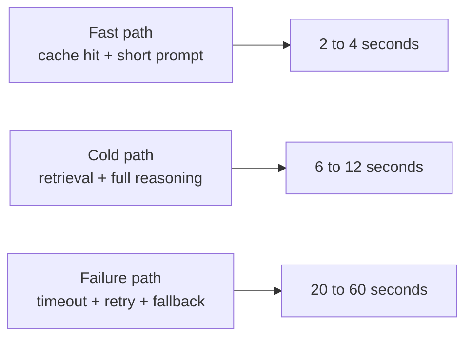
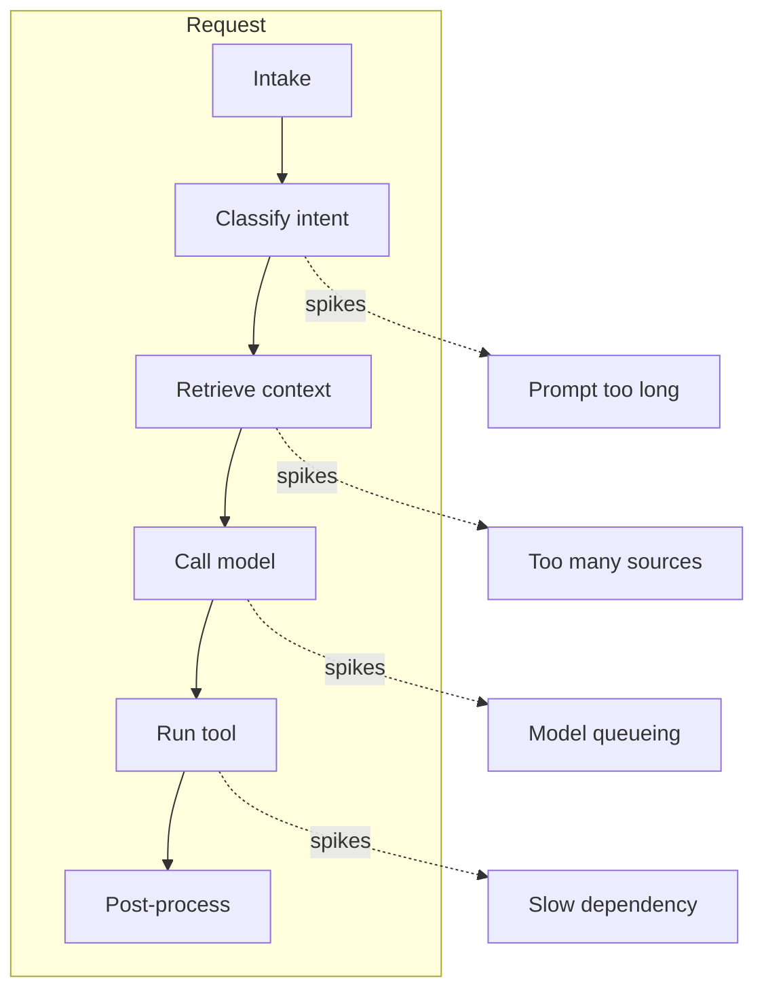
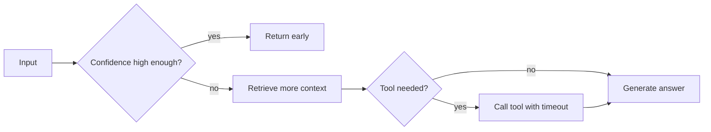

## Why averages fail in agent systems

An agent that averages 2 seconds per request can still feel broken.

That is not a paradox. It is a distribution problem.

Agentic systems are composed of retrieval, tool calls, branching, retries, and fallback paths. That makes latency heavy-tailed. A few slow requests do not just skew the mean; they define what users remember.

### A simple shape of reality



The mean hides the failure path. p95 and p99 expose it.

## What the percentiles tell you

- p50 tells you what the typical request feels like.
- p95 tells you whether most users will call it “fast enough.”
- p99 tells you whether the system is trustworthy under load.
- p999 tells you when support and incident response start to matter.

If your p99 jumps from 4 seconds to 18 seconds, the product changed even if the average barely moved.

## Where the tail comes from

The slowest requests usually come from one of four places.

1. Cold starts in the model or runtime.
2. Long retrieval chains across many documents.
3. Retry storms when a tool or API starts failing.
4. Overlong prompts that force the model to process too much context.



The fix is not “make the model faster.” The fix is to isolate each stage and assign a budget to it.

## Stage budgets that actually help

Think in budgets, not vibes.

```python
LATENCY_BUDGET_MS = {
        "intent_classification": 150,
        "context_retrieval": 700,
        "model_inference": 1600,
        "tool_execution": 1200,
        "response_finalization": 250,
        "p95_total": 3000,
        "p99_total": 5000,
}


def check_stage_budget(stage_times_ms: dict[str, int]) -> bool:
        total = sum(stage_times_ms.values())
        return total <= LATENCY_BUDGET_MS["p95_total"]
```

This is useful for two reasons.

First, it makes regressions visible. Second, it tells you where to invest engineering time. A 200 ms improvement in retrieval matters more than a 200 ms win in a stage that only runs on 10 percent of requests.

## How to reduce p99 without breaking the product

- Cache expensive intermediate results.
- Use smaller retrieval sets before the model sees the full context.
- Fail fast on slow dependencies instead of waiting for the whole chain.
- Start the next stage speculatively when the current stage is already confident.
- Cut tool calls when the answer is already sufficiently certain.



That last point matters. Many systems are slow because they keep doing work after they already know enough to answer safely.

## What to alert on

Alert on percentile drift, not just uptime.

- p95 increasing for 10 minutes straight.
- p99 crossing your user-facing SLA.
- A specific stage consuming most of the latency budget.
- Retry rate rising together with tail latency.
- Queue depth increasing before the latency spike appears.

## The practical rule

If you only remember one thing, remember this: averages are for summaries, percentiles are for systems.

In agent products, p95 and p99 are the metrics that determine whether users trust the workflow enough to come back.

## Related Posts

- [Observability for Black-Box Agents: Tracing Decisions in Production](/blog/agent-observability)
- [Orchestrating Agents at Scale: When You Need a Supervisor, Not a Bigger Model](/blog/orchestrating-agents-scale)
- [Token Economics: Why Your Agent Architecture Is Costing 10x More Than It Should](/blog/token-economics-agent-architecture)