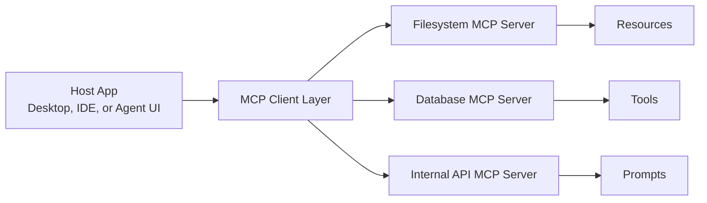

## Why MCP matters

Before MCP, every model integration was a one-off project. If you wanted your agent to read files, query a database, or call an internal API, you wrote a custom adapter for each stack and duplicated the same plumbing across providers.

MCP changes the shape of the problem. It gives you a protocol instead of a pile of wrappers. That matters because protocols create ecosystems: one server can serve many clients, and one client can talk to many servers.

> [!TIP]
> If your current agent architecture has model-specific glue code scattered across services, MCP is usually a better abstraction boundary than more prompt engineering.

## The mental model



The important shift is not only technical. It is organizational. A host owns the conversation. A client owns transport and connection management. A server owns a narrow capability surface.

That separation keeps your agent from becoming a monolith of tool calls.


## What MCP standardizes

MCP is most useful when the model needs to interact with the real world in a structured way.

### Tools

Tools are actions. They should be explicit, typed, and easy to audit. If the agent can trigger a side effect, that side effect should live behind a tool boundary.

### Resources

Resources are data. They are read-only by default and should be easy to paginate, filter, and stream.

### Prompts

Prompts are reusable context packages. They are the difference between "here is a giant system prompt" and "here is a named, versioned behavior contract."

### Sampling

Sampling lets the server request model assistance during a workflow. That is useful when the server has domain logic but still needs the model for reasoning or summarization.

## A practical implementation pattern

The best MCP server is not a demo that looks clever in a README. It is a narrow service that does one job well.

For example, a local system-monitor server might expose:

- `get_system_load`
- `list_recent_errors`
- `read_config`
- `summarize_log_window`

```python
from mcp.server.fastmcp import FastMCP

import psutil

mcp = FastMCP("SystemMonitor")


@mcp.tool()
def get_system_load() -> dict:
    """Return a structured snapshot of current machine load."""
    return {
        "cpu_percent": psutil.cpu_percent(interval=0.2),
        "memory_percent": psutil.virtual_memory().percent,
        "disk_percent": psutil.disk_usage("/").percent,
    }


@mcp.tool()
def summarize_recent_logs(path: str, limit: int = 80) -> dict:
    """Read the tail of a log file and return a compact summary."""
    try:
        with open(path, "r", encoding="utf-8") as handle:
            lines = handle.readlines()[-limit:]
        return {
            "path": path,
            "line_count": len(lines),
            "preview": "".join(lines[-20:]),
        }
    except FileNotFoundError:
        return {"error": f"File not found: {path}"}


if __name__ == "__main__":
    mcp.run()
```

This is more valuable than a generic demo because it shows two things production systems need: narrow scope and predictable outputs.

## Where MCP improves the stack

MCP is most useful in systems where the model is not the entire product. In practice, that means:

1. Desktop hosts that need secure local tools.
2. IDE integrations that need project-aware context.
3. Internal agent platforms that talk to databases or ticketing systems.
4. Multi-model apps that should not duplicate tool adapters.

## What to watch out for

MCP is not a magic answer to bad architecture. If your server exposes too many tools, you will recreate the same complexity you were trying to remove.

Keep these rules in mind:

- Prefer small, composable tool surfaces.
- Return structured data, not prose, whenever possible.
- Version your prompts and schema contracts.
- Treat server outputs as untrusted until validated.
- Put permissions and audit logging around anything that can mutate state.

> [!WARNING]
> A protocol makes integration easier, but it also makes overexposure easier. If every internal service becomes an MCP server, you have to be more disciplined about scope and authentication.

## A decision checklist

Use MCP when:

- You need one integration standard for many hosts or models.
- Your tools have structured inputs and outputs.
- You care about separation between reasoning and execution.

Do not use MCP as a band-aid when:

- The integration is a one-off script.
- The capability is not stable enough to publish as a contract.
- You cannot define safe permissions or outputs.

## The bigger picture

MCP matters because it turns AI tooling into infrastructure. That is the shift from demos to ecosystems.

The teams that win with agentic systems will not be the teams that call the most tools. They will be the teams that define the cleanest boundaries.

---

*If you build one MCP server well, you can reuse it across many hosts. That is the real multiplier.*