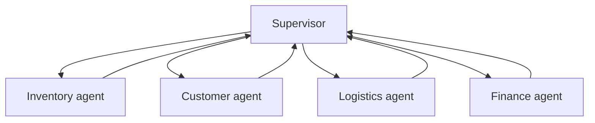
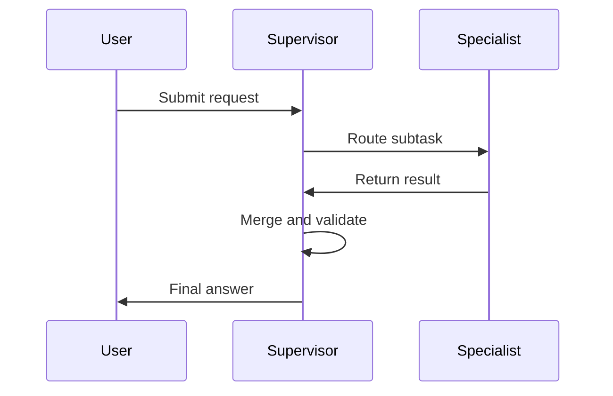

## Bigger models do not solve coordination

As systems grow, the temptation is to ask one bigger model to do everything.

That usually shifts the problem, not the outcome. The hard part is not raw intelligence. It is routing, state sharing, retries, and failure isolation.



The supervisor manages coordination. The specialists do the work they are best at.

## Why monolithic agents break down

One large agent must keep too many things in its working context.

It has to remember the task, the current substate, the tool outputs, the exceptions, and the policy constraints all at once. That creates brittle reasoning and expensive retries.

In practice, the failure looks like this:

1. The agent starts with a reasonable plan.
2. It branches into multiple subproblems.
3. One branch fails and contaminates the rest of the reasoning.
4. The whole request becomes expensive to recover.

## What a supervisor should actually do

The supervisor should not solve every subproblem.

It should:

- Route work to the right specialist.
- Merge outputs into a single decision.
- Decide when to retry or escalate.
- Keep the context boundary explicit.

```python
class Supervisor:
		def route(self, request: dict) -> str:
				if request["type"] == "inventory":
						return "inventory_agent"
				if request["type"] == "customer":
						return "customer_agent"
				if request["type"] == "payment":
						return "finance_agent"
				return "generalist_agent"
```

That routing layer is the core architecture. Everything else depends on it.

## Why specialization scales better

Specialists have narrower prompts, smaller state, and clearer evaluation.

- Lower latency because each agent does less work.
- Lower cost because you do not call the biggest model for everything.
- Better debugging because failures are isolated.
- Better governance because each agent can have its own policy.



## Failure recovery matters

If one specialist fails, the system should degrade gracefully.

- Retry the failed branch.
- Fall back to a cheaper or safer path.
- Escalate only the affected step.
- Keep the rest of the workflow intact.

That is difficult to do in a monolith and much easier to do in a coordinated graph.

## When not to split

Specialization is not free.

Do not split a workflow when the subtask boundaries are fuzzy, the cost of coordination is higher than the gain, or the system is still too small to justify the overhead.

## Practical rule

Use a supervisor when coordination is the problem.

Use a larger model only when the underlying task truly requires broader reasoning, not when the workflow is simply too tangled.

## Related Posts

- [Token Economics: Why Your Agent Architecture Is Costing 10x More Than It Should](/blog/token-economics-agent-architecture)
- [State Management Without the Mess: Deterministic Agent Memory for Long-Running Systems](/blog/state-management-agent-memory)
- [Observability for Black-Box Agents: Tracing Decisions in Production](/blog/agent-observability)