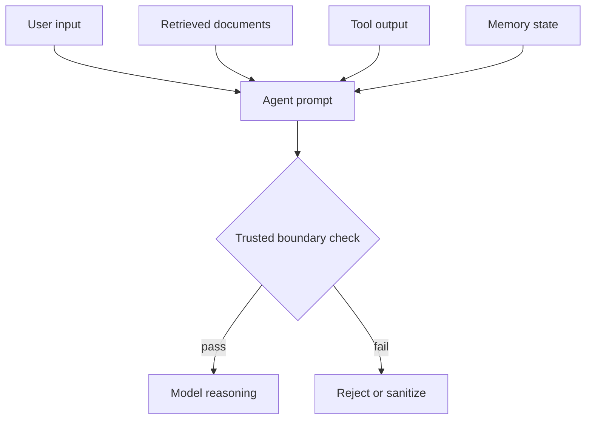
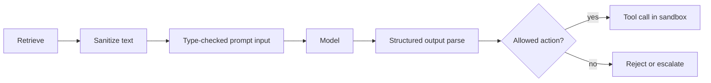

## Treat injection as a trust-boundary problem

Prompt injection is not just a user typing something clever into a chat box.

In an agent, untrusted text can enter through retrieval, memory, tool output, or even another agent’s response. That means the defense has to be systemic.



If any of those inputs can silently change behavior, the system is not secure.

## Common injection surfaces

1. Retrieval poisoning from documents that contain malicious instructions.
2. Tool argument injection from crafted strings passed into external APIs.
3. Memory contamination from untrusted state being written back as fact.
4. Cross-agent contamination when one agent’s output becomes another agent’s instruction.

The key mistake is assuming the model can sort out intent on its own. It cannot be the firewall.

## The architecture that works better

Security improves when you make the boundaries explicit.

1. Validate inputs before they reach the model.
2. Parse outputs into typed structures.
3. Limit which tools can be called in which contexts.
4. Sandbox side effects.
5. Separate policy decisions from generation.

```python
from pydantic import BaseModel, field_validator


class ReturnCheckRequest(BaseModel):
    customer_id: int
    order_id: int
    reason: str

    @field_validator("customer_id")
    @classmethod
    def validate_customer_id(cls, value: int) -> int:
        if value < 0 or value > 1_000_000_000:
            raise ValueError("invalid customer_id")
        return value


class Agent:
    async def handle_request(self, raw_input: dict):
        request = ReturnCheckRequest.model_validate(raw_input)
        return await self.process_return_check(request)
```

The point is not just type safety. The point is to make malicious text lose its ability to steer execution.

## Defend each layer differently

Retrieval needs sanitization. Tools need strict schemas. Memory needs write rules. Output needs filtering.



This is where most implementations fall apart. They sanitize the input once and then let the output re-enter the system as if it were trusted.

## Testing matters as much as policy

Defenses are only real if they survive adversarial tests.

- Try retrieval passages that contain override instructions.
- Feed tools strings that look like prompt fragments.
- Verify that invalid fields fail closed.
- Confirm that model output cannot call tools outside policy.
- Add regression tests for every injection you discover.

## What not to rely on

- Prompt wording alone.
- A single system message.
- “The model will understand the intent.”
- Post-hoc review after side effects already happened.

## The practical rule

If a string is not trusted, it should not be able to change policy, tool choice, or memory.

That rule is simple, but it is the difference between an agent that behaves and an agent that can be steered by whatever text reaches it first.

## Related Posts

- [Observability for Black-Box Agents: Tracing Decisions in Production](/blog/agent-observability)
- [The Hallucination Budget: Quantifying Risk for Mission-Critical Agents](/blog/hallucination-budget)
- [When Agents Should Not Decide: Building Confidence Thresholds for Human Handoff](/blog/agent-confidence-thresholds)