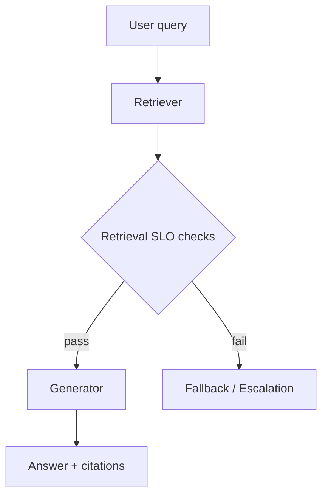
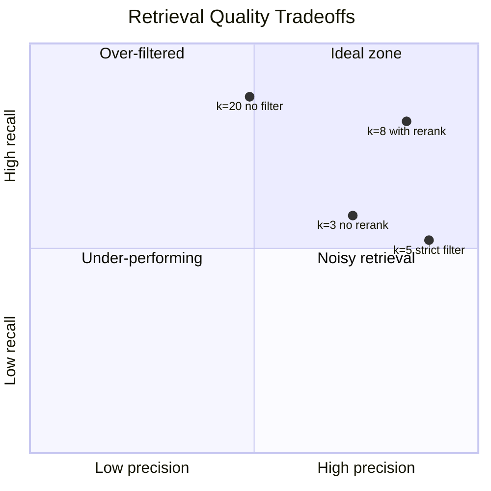

## Generation quality is capped by retrieval quality

A model cannot faithfully answer what it never retrieved.

Teams often tune prompts while ignoring retrieval drift. That creates a dangerous illusion: fluent answers that are grounded in weak evidence.

If RAG is core to your product, retrieval quality needs service-level objectives, not occasional dashboard checks.

## Define retrieval SLOs in plain language

Your SLOs should match what users care about.

Useful retrieval SLOs:

1. Coverage SLO: At least one relevant chunk appears in top-k for known-good queries.
2. Precision SLO: Top-k is not overloaded with irrelevant chunks.
3. Freshness SLO: Returned content reflects recent source updates.
4. Latency SLO: Retrieval completes within a strict budget.



That decision gate protects users from confident nonsense.

## Instrument retrieval separately from generation

You need independent telemetry for each stage.

Track retrieval metrics per request:

- Candidate count
- Top-k scores
- Chunk-source diversity
- Freshness timestamp lag
- Null or low-confidence retrieval rate

```python
def retrieval_health(top_k_chunks: list[dict], threshold: float = 0.72) -> dict:
    if not top_k_chunks:
        return {"ok": False, "reason": "no_chunks"}

    best_score = top_k_chunks[0]["score"]
    diverse_sources = len({c["source_id"] for c in top_k_chunks}) >= 2

    ok = best_score >= threshold and diverse_sources
    return {
        "ok": ok,
        "best_score": best_score,
        "diverse_sources": diverse_sources,
    }
```

If retrieval health fails, block final answers or shift to a safe fallback.

## Build failure-aware response policy

When evidence is weak, the product should behave differently.

Reasonable fallback policy:

- Ask a clarification question.
- Narrow scope to verified sources.
- Escalate to human support for high-risk intents.
- Explicitly state uncertainty and avoid fabricated certainty.

This turns silent failure into visible uncertainty, which is far safer.

## Calibrate top-k and reranking with real traffic

Default values are rarely optimal.

Calibrate on representative query slices:

- Short keyword queries
- Multi-hop informational questions
- Entity-heavy internal questions
- Misspelled/noisy user text



Tune for your risk profile, not benchmark vanity.

## Source freshness is a first-class metric

Many production incidents come from stale documents that remain highly ranked.

Mitigations:

- Track ingestion lag.
- Apply source version tags in index metadata.
- Penalize stale chunks during rerank.
- Trigger fast-path reindex for critical sources.

A "correct but outdated" answer can be as harmful as a wrong one.

## Test retrieval with adversarial and edge queries

A strong retrieval system should survive:

- Synonym drift and paraphrases
- Query injection patterns in source documents
- Similar but conflicting policy documents
- Missing source scenarios

These tests should run in CI, not only during incident response.

## Practical takeaway

Reliable RAG is not a prompt trick. It is a retrieval reliability discipline.

Set SLOs, monitor them continuously, and refuse to answer with high confidence when evidence quality is below threshold.

## Related Posts

- [Prompt Injection in Agents: Defense Patterns That Actually Work](/blog/prompt-injection-defense)
- [Observability for Black-Box Agents: Tracing Decisions in Production](/blog/agent-observability)
- [The Latency Trap: Why 99th-Percentile Response Time Matters More Than Average](/blog/latency-percentiles)
