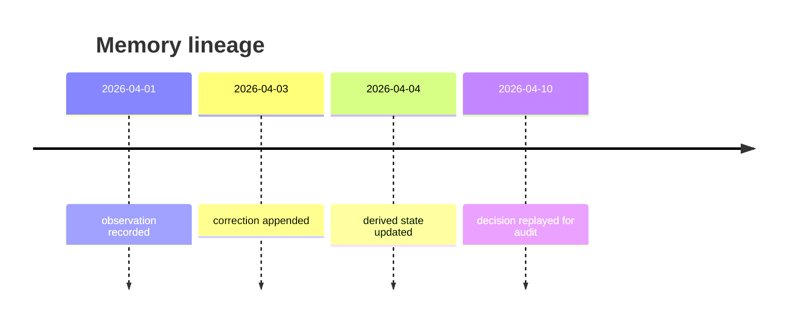

## Why semantic memory is not enough

Vector search is great for recall.

It is not great for auditability.

When you need to explain why an agent made a decision a month ago, semantic similarity is not enough. You need the exact sequence of facts, corrections, and state transitions that led to the action.


The log is the source of truth. The derived state is the convenience layer.

## What usually goes wrong

Vector databases are mutable in ways that are hard to reason about.

- Embeddings change when models change.
- Retrieval order changes when indexes are rebuilt.
- Relevance changes when the corpus drifts.
- Reproducing a past decision becomes guesswork.

That is fine for chat memory. It is risky for systems that make business, legal, or operational decisions.

## Event sourcing is the better default

Store facts as events, not just as current summaries.

```python
from dataclasses import dataclass
from datetime import datetime
from enum import Enum


class FactType(Enum):
    OBSERVATION = "observation"
    INFERENCE = "inference"
    CORRECTION = "correction"
    RETRACTION = "retraction"


@dataclass
class MemoryEvent:
    event_id: str
    timestamp: datetime
    fact_type: FactType
    content: str
    source: str
    confidence: float
    reasoning: str
    model_version: str
    superseded_by: str | None = None
```

This makes memory inspectable and replayable.

## A memory system should answer one question

What did the agent know at decision time?

That requires an immutable log plus a derived view.

```python
class EventSourcedMemory:
    def append(self, event: MemoryEvent) -> None:
        self.events.append(event)
        self._persist(event)
        self._update_state(event)

    def reconstruct(self, decision_timestamp: datetime) -> list[MemoryEvent]:
        return [
            event for event in self.events
            if event.timestamp <= decision_timestamp
        ]
```

If a correction arrives later, do not delete the old fact. Mark it as superseded.

## Why this matters in production

Event logs give you:

- A replayable audit trail.
- Deterministic debugging.
- Better compliance posture.
- Clear source lineage for facts.



That kind of reconstruction is what makes long-running systems supportable.

## Keep vector search as a cache

You can still use embeddings.

Just do not treat them as authoritative.

- Use vector search for fast retrieval.
- Use the event log for truth.
- Use derived state for runtime convenience.

That separation gives you speed without losing history.

## Practical rule

If a system can influence decisions, its memory should be reconstructible.

For mission-critical agents, deterministic memory is not a luxury feature. It is the minimum structure required to trust the system later.

## Related Posts

- [Observability for Black-Box Agents: Tracing Decisions in Production](/blog/agent-observability)
- [The Hallucination Budget: Quantifying Risk for Mission-Critical Agents](/blog/hallucination-budget)
- [Orchestrating Agents at Scale: When You Need a Supervisor, Not a Bigger Model](/blog/orchestrating-agents-scale)