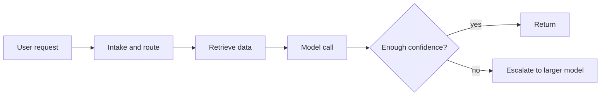

## The real cost is structural

Teams often tune prompts first because it feels cheap and visible.

The problem is that prompt polish only affects a small part of the bill. The real cost comes from how often you call the model, how much context you send, and how many times you repeat work.



The cheapest token is the one you never spend.

## Measure cost by request type

The first step is not optimization. It is attribution.

- How many tokens does one request type consume?
- Which stage repeats the same work?
- Which request path needs the expensive model at all?

```python
from dataclasses import dataclass


@dataclass
class TokenRecord:
    request_type: str
    prompt_tokens: int
    completion_tokens: int
    model: str


def request_cost(record: TokenRecord, rate_per_1k: float) -> float:
    total_tokens = record.prompt_tokens + record.completion_tokens
    return (total_tokens / 1000) * rate_per_1k
```

If you do not know the cost per request type, you cannot decide which optimization matters.

## Where the waste usually is

1. Repeating classification that could happen outside the model.
2. Sending too much context when only a small slice is needed.
3. Re-running retrieval for requests within the same session.
4. Using the largest model for tasks that a smaller model can handle.

```mermaid
barChart
  title Token Waste by Stage
  x-axis Intake --> Retrieval --> Generation --> Retry paths
  y-axis Tokens
  data: 400, 1800, 1200, 900
```

The pattern is clear: the architecture, not the wording, drives most of the spend.

## The four highest-leverage levers

### 1. Cache aggressively where the result is reusable

Session-level facts, policies, and recent lookups should not be recomputed for every turn.

### 2. Route tasks to the smallest model that can handle them

Use a cheap model for classification, extraction, and simple routing. Escalate only when the task actually needs it.

### 3. Prune context before it reaches the model

If only one paragraph matters, send one paragraph.

### 4. Cascade by confidence

Try the cheap path first. Escalate only on uncertainty.

```python
class ModelRouter:
    def choose_model(self, task: str, context_length: int) -> str:
        if task in {"classification", "extraction"}:
            return "small-model"
        if context_length > 3000:
            return "large-model"
        return "mid-model"
```

## Budget the system, not the prompt

Think in terms of total monthly impact.

```text
Baseline monthly cost: $50,000
Caching and reuse:     -$12,000
Context pruning:       -$10,000
Routing:               -$9,000
Confidence cascade:    -$8,000
Retry reduction:       -$4,000
Remaining cost:        $7,000
```

The exact numbers will differ, but the shape usually does not.

## Practical rule

If you want a lower bill, change the architecture first.

Prompt refinement is a finishing pass. It is not the primary cost control mechanism.

## Related Posts

- [Orchestrating Agents at Scale: When You Need a Supervisor, Not a Bigger Model](/blog/orchestrating-agents-scale)
- [The Hallucination Budget: Quantifying Risk for Mission-Critical Agents](/blog/hallucination-budget)
- [State Management Without the Mess: Deterministic Agent Memory for Long-Running Systems](/blog/state-management-agent-memory)