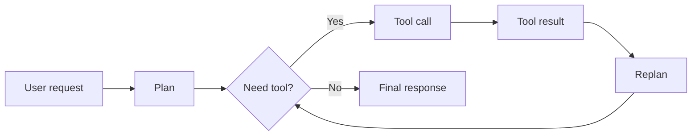
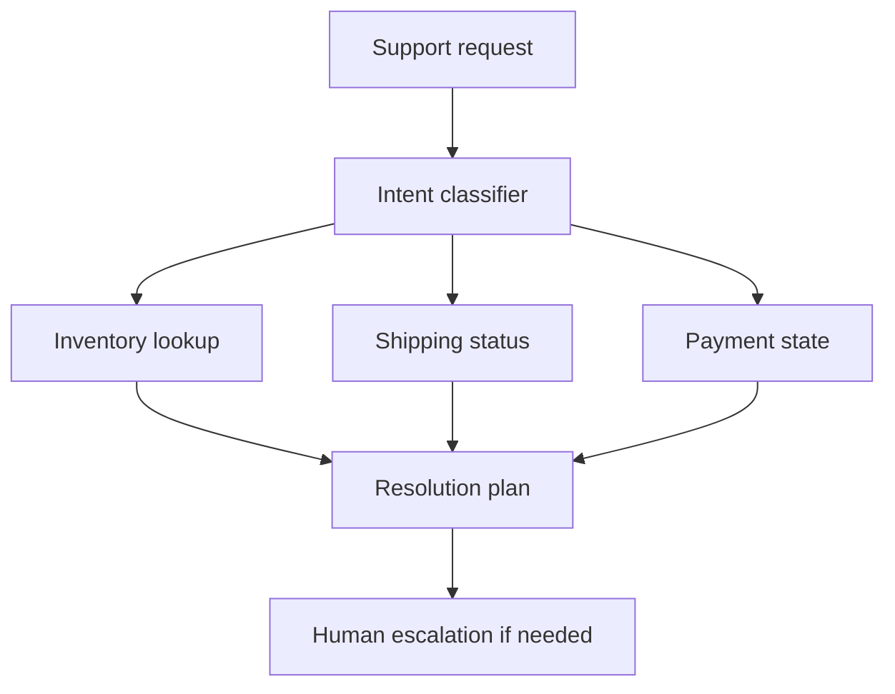

## The paradox of power

You can build an agent that has 47 tools and still have a slow, brittle system that users abandon.

That is the tool-use illusion: the belief that capability grows linearly with tool count. In practice, every new tool adds planning overhead, integration cost, failure modes, and latency.

The framework looks impressive. The production system is the opposite.

> [!TIP]
> A useful agent is not the one that can call the most tools. It is the one that can finish the job with the fewest decisions and the clearest execution path.

## What actually slows agents down

Every tool call creates a small chain of work:

1. The model decides whether to call the tool.
2. The tool runs and may wait on the network.
3. The model reads the output and decides what to do next.



The hidden tax is re-planning. Most frameworks treat tool selection as if it were free. It is not. It consumes tokens, increases latency, and creates more failure branches.

## Why more tools make agents fragile

The real pain does not come from a single tool call. It comes from branching behavior.

- Tool A fails, so Tool B never runs.
- Tool C depends on Tool A, but the dependency is implicit.
- Tool D can run in parallel, but the framework serializes it anyway.
- Tool E returns noisy data, so the model retries and spends more tokens.

That is how a simple workflow becomes a decision tree with no visible boundaries.

## The production lesson

The solution is not "fewer tools forever." The solution is explicit orchestration.

Tool capability should be separated from orchestration logic. The model can still reason, but it should not be responsible for discovering every dependency from scratch.

### Use a dependency graph

```python
from dataclasses import dataclass
from typing import Callable, List


@dataclass
class ToolNode:
    name: str
    fn: Callable
    dependencies: List[str]
    can_fail: bool = True
    parallel_group: str | None = None


class OrchestrationGraph:
    def __init__(self):
        self.nodes = {}

    def add_tool(self, node: ToolNode):
        self.nodes[node.name] = node

    def build_plan(self):
        executed = set()
        stages = []

        while len(executed) < len(self.nodes):
            stage = []
            for name, node in self.nodes.items():
                if name in executed:
                    continue
                if all(dep in executed for dep in node.dependencies):
                    stage.append(name)
            if not stage:
                break
            stages.append(stage)
            executed.update(stage)

        return stages
```

This is not fancy. That is the point. The plan is visible, testable, and debuggable.

## What to measure

You need more than task success rates.

Track these metrics together:

- Time to first useful answer.
- Total tool calls per request.
- Retry count per tool.
- p95 and p99 latency.
- Token cost per successful completion.

If those numbers rise together, the system is getting worse even if the benchmark score looks fine.

## A practical e-commerce example

Consider a support agent with tools for inventory, shipping, payment, and refunds.

The naive version calls tools in sequence because the model is uncertain about dependencies.

The better version looks like this:



Now the system can parallelize independent queries and only escalate when confidence is low or when the policy says to stop.

## Common anti-patterns

### 1. Letting the model discover every tool path

This looks flexible and feels elegant, but it creates runtime ambiguity. Ambiguity becomes latency.

### 2. Overloading tools with too many responsibilities

If one tool returns customer state, pricing, shipping, and refund eligibility, you have not reduced complexity. You have just moved it.

### 3. Ignoring the cost of failure branches

Every retry path has a cost. Every fallback has a maintenance burden. Every ambiguous result adds another model turn.

> [!WARNING]
> Tool-rich agents often fail because the orchestration layer was designed as an afterthought. If the graph is implicit, the model becomes the scheduler, and that is usually too expensive.

## The fix

Make orchestration explicit and keep the model focused on judgment rather than workflow management.

- Encode dependencies in code.
- Run independent tools in parallel.
- Set failure policies per tool.
- Keep outputs typed and structured.
- Escalate to a human when the next best action is risky, not when the model gets tired.

## The takeaway

The tool-use illusion is seductive because it looks like progress.

But production systems do not reward impressive tool counts. They reward systems that are fast, predictable, and easy to debug. The winning architecture is usually less magical and more explicit.

---

*If the model is doing all the orchestration, your architecture is probably too fragile.*